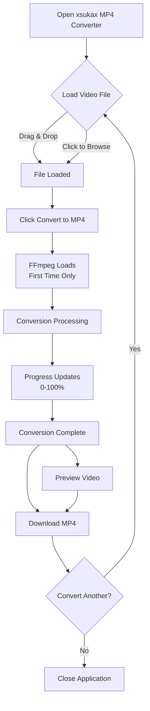
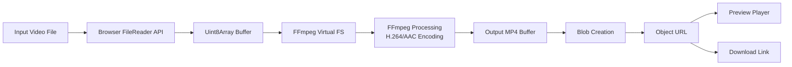

# xsukax MP4 Converter

[](https://www.gnu.org/licenses/gpl-3.0)
[](https://github.com/xsukax/xsukax-MP4-Converter)

A powerful, privacy-focused, browser-based video converter that transforms any video format into high-quality MP4 files—completely client-side, with no server uploads required.

## 🎯 Project Overview

**xsukax MP4 Converter** is a modern web application that leverages FFmpeg WebAssembly technology to provide universal video-to-MP4 conversion directly within your browser. Unlike traditional online converters that require uploading files to remote servers, this application performs all processing locally on your device, ensuring maximum privacy and security.

The converter supports a wide array of video formats including WebM, AVI, MKV, MOV, FLV, WMV, and many others. It produces standardized MP4 output using industry-standard H.264 video encoding and AAC audio encoding, optimized for compatibility across all modern devices and platforms.

### Primary Functionalities

- **Universal Format Support**: Accepts virtually any video format as input
- **Client-Side Processing**: All conversions happen locally in your browser using FFmpeg WebAssembly
- **High-Quality Output**: Produces MP4 files with H.264/AAC encoding using optimized quality settings
- **Intuitive Interface**: Drag-and-drop functionality with real-time progress feedback
- **Instant Preview**: Built-in video player to preview converted files before downloading
- **Zero Dependencies**: No server infrastructure, accounts, or subscriptions required

## 🔒 Security and Privacy Benefits

This application is architected with privacy-first principles, implementing multiple layers of protection for user data:

### Complete Client-Side Processing

All video conversion operations are executed entirely within your browser using WebAssembly technology. Your video files never leave your device, eliminating the risks associated with:
- Data interception during transmission
- Unauthorized server-side storage
- Third-party access to your content
- Potential data breaches on remote servers

### Zero Data Collection

The application implements a strict no-logging policy:
- **No tracking scripts**: No analytics, cookies, or tracking pixels
- **No user accounts**: No registration, login, or personal information required
- **No metadata retention**: File information exists only in your browser's memory during conversion
- **No server communication**: After the initial page load, the application operates completely offline

### Open Source Transparency

The entire codebase is publicly available under the GPL v3.0 license, allowing security researchers and developers to audit the implementation and verify privacy claims. This transparency ensures accountability and builds trust through community oversight.

### Local File System Protection

Files are processed in-memory using the browser's FileReader API and FFmpeg's virtual filesystem. No temporary files are written to your device's permanent storage, and all data is cleared from memory once the conversion completes or the page is closed.

## ✨ Features and Advantages

### Key Benefits

- **🌐 100% Browser-Based**: No software installation, works on Windows, macOS, Linux, iOS, and Android
- **🔐 Privacy-First Architecture**: Your files never leave your device
- **⚡ Fast Processing**: Leverages WebAssembly for near-native performance
- **💰 Completely Free**: No hidden costs, subscriptions, or usage limits
- **🎨 User-Friendly Interface**: Clean, intuitive design with drag-and-drop support
- **📊 Real-Time Progress**: Visual feedback throughout the conversion process
- **🎬 Instant Preview**: Preview converted videos before downloading
- **📱 Cross-Platform**: Works on any device with a modern web browser
- **🔄 Unlimited Conversions**: No file size limits or conversion quotas
- **🌍 Works Offline**: After initial load, functions without internet connectivity

### Unique Selling Points

1. **True Privacy**: Unlike cloud-based converters, your videos remain completely private
2. **No Quality Loss from Compression**: Direct FFmpeg encoding without re-encoding artifacts from server processing
3. **No Upload Wait Times**: Start converting immediately without waiting for uploads
4. **Open Source**: Full transparency and community-driven development
5. **Self-Hostable**: Deploy on your own infrastructure for complete control

## 🚀 Installation Instructions

### Option 1: Use the Hosted Version

Simply visit the hosted application in your web browser:

```
https://xsukax.github.io/xsukax-MP4-Converter/
```

No installation required—the application loads directly in your browser.

### Option 2: Self-Hosting (GitHub Pages)

1. **Fork the Repository**
   ```bash
   # Fork via GitHub web interface, then clone your fork
   git clone https://github.com/YOUR_USERNAME/xsukax-MP4-Converter.git
   cd xsukax-MP4-Converter
   ```

2. **Enable GitHub Pages**
   - Navigate to your repository on GitHub
   - Go to Settings → Pages
   - Select "Deploy from a branch"
   - Choose the `main` branch and `/ (root)` folder
   - Click Save

3. **Access Your Deployment**
   ```
   https://YOUR_USERNAME.github.io/xsukax-MP4-Converter/
   ```

### Option 3: Local Deployment

1. **Clone the Repository**
   ```bash
   git clone https://github.com/xsukax/xsukax-MP4-Converter.git
   cd xsukax-MP4-Converter
   ```

2. **Serve with a Local Web Server**
   
   Using Python:
   ```bash
   # Python 3
   python -m http.server 8000
   
   # Python 2
   python -m SimpleHTTPServer 8000
   ```
   
   Using Node.js (http-server):
   ```bash
   npx http-server -p 8000
   ```
   
   Using PHP:
   ```bash
   php -S localhost:8000
   ```

3. **Access the Application**
   ```
   http://localhost:8000
   ```

### Prerequisites

- **Modern Web Browser**: Chrome 90+, Firefox 88+, Safari 14+, or Edge 90+
- **WebAssembly Support**: Required (available in all modern browsers)
- **Adequate RAM**: At least 4GB recommended for processing large video files

### Required Files Structure

```
xsukax-MP4-Converter/
├── index.html                    # Main application file
├── ffmpegWasmBarebones.js       # FFmpeg WASM loader
└── ffmpeg-core/
    ├── ffmpeg-core.js           # FFmpeg core module
    └── ffmpeg-core.wasm         # FFmpeg WebAssembly binary
```

**Note**: Ensure the `ffmpeg-core` directory and files are present in the same directory as `index.html` for the application to function correctly.

## 📖 Usage Guide

### Basic Workflow



### Step-by-Step Instructions

#### Step 1: Access the Application

Navigate to the application URL in your web browser. The interface will load with an upload area and conversion controls.

#### Step 2: Select Your Video File

**Method A - Drag and Drop:**
1. Locate the video file on your computer
2. Drag it over the upload area (the area will highlight)
3. Drop the file to select it

**Method B - File Browser:**
1. Click on the upload area
2. Browse your file system in the dialog that appears
3. Select your video file and click Open

**Supported formats include:** WebM, AVI, MKV, MOV, FLV, WMV, MPG, MPEG, M4V, 3GP, and many others.

#### Step 3: Initiate Conversion

Once a file is selected, you'll see the filename and file size displayed below the upload area. Click the **"Convert to MP4"** button to begin the conversion process.

#### Step 4: Monitor Progress

The application will display status updates throughout the conversion:
- **Loading FFmpeg**: First-time initialization (subsequent conversions skip this step)
- **Writing input file**: Preparing your video for processing
- **Converting to MP4**: Active conversion with percentage progress (0-100%)
- **Reading output file**: Finalizing the converted video

#### Step 5: Preview and Download

Once conversion completes:
1. The converted video will appear in a preview player
2. Click the video to play and verify the conversion
3. Click the **"Download MP4"** button to save the file to your device

The downloaded file will retain your original filename with the extension changed to `.mp4`.

### Conversion Architecture



### Technical Specifications

**Video Encoding:**
- Codec: H.264 (libx264)
- Preset: Medium (balances speed and quality)
- CRF: 23 (visually lossless to near-transparent quality)

**Audio Encoding:**
- Codec: AAC
- Bitrate: 128 kbps (suitable for most content)

**Processing Flow:**
1. File loaded into browser memory
2. FFmpeg WebAssembly module initialized (first conversion only)
3. Video written to FFmpeg's virtual filesystem
4. FFmpeg processes the conversion with specified parameters
5. Output MP4 read from virtual filesystem
6. Result presented for preview and download
7. Memory cleared upon completion

### Troubleshooting

**"FFmpeg failed with return code" error:**
- The input file may be corrupted or unsupported
- Try with a different video file
- Check browser console for detailed error messages

**Conversion is very slow:**
- Large files require more processing time
- Close unnecessary browser tabs to free up memory
- Consider using a desktop browser for better performance

**Browser crashes or freezes:**
- The video file may be too large for available RAM
- Try processing smaller files or segments
- Increase available memory by closing other applications

**Download button not working:**
- Check browser popup blocker settings
- Verify sufficient disk space for the output file
- Try a different browser

## 📋 System Requirements

### Minimum Requirements
- **Browser**: Any modern browser with WebAssembly support (2020 or newer)
- **RAM**: 2GB available (for small to medium video files)
- **Storage**: Sufficient space for input and output files

### Recommended Requirements
- **Browser**: Latest version of Chrome, Firefox, or Edge
- **RAM**: 8GB or more (for large video files)
- **Processor**: Multi-core CPU for faster processing
- **Storage**: SSD for improved file I/O performance

## 🤝 Contributing

Contributions are welcome! If you'd like to improve xsukax MP4 Converter:

1. Fork the repository
2. Create a feature branch (`git checkout -b feature/amazing-feature`)
3. Commit your changes (`git commit -m 'Add amazing feature'`)
4. Push to the branch (`git push origin feature/amazing-feature`)
5. Open a Pull Request

Please ensure your code follows existing style conventions and include appropriate documentation.

## 📄 License

This project is licensed under the GNU General Public License v3.0.

## 🙏 Acknowledgments

- **FFmpeg Team**: For the incredible FFmpeg media processing framework
- **FFmpeg.wasm**: For making FFmpeg accessible in web browsers through WebAssembly
- **Open Source Community**: For continued support and contributions

## 📧 Contact

For issues, suggestions, or questions:
- **GitHub Issues**: [xsukax-MP4-Converter/issues](https://github.com/xsukax/xsukax-MP4-Converter/issues)
- **GitHub Repository**: [xsukax/xsukax-MP4-Converter](https://github.com/xsukax/xsukax-MP4-Converter)

---

**Made with ❤️ for privacy-conscious users worldwide**
